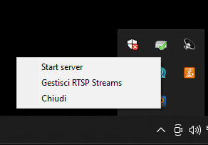
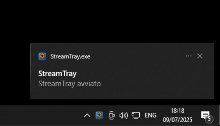

### README — **StreamTray v 2.0.1**

<div id="top"></div>

<!-- PROJECT SHIELDS -->
[![Contributors][contributors-shield]][contributors-url]
[![Forks][forks-shield]][forks-url]
[![Stargazers][stars-shield]][stars-url]
[![Issues][issues-shield]][issues-url]
[![Apache 2.0 License][license-shield]][license-url]

<!-- PROJECT LOGO -->
<div align="center">
  <a href="https://github.com/zEhmsy/StreamTray">
    
  </a>

  <h3 align="center">StreamTray&nbsp;2.0.1</h3>

  <p align="center">
    Tiny Python tray-server that converts any <strong>RTSP</strong> camera/DVR<br>
    into lightweight <strong>MJPEG</strong> feeds for browsers &amp; mobile apps.<br>
    <br />
    <a href="https://github.com/zEhmsy/StreamTray"><strong>Explore the docs »</strong></a>
    ·
    <a href="https://github.com/zEhmsy/StreamTray/issues">Report Bug</a>
    ·
    <a href="https://github.com/zEhmsy/StreamTray/issues">Request Feature</a>
  </p>
</div>

<!-- TABLE OF CONTENTS -->
<details>
  <summary>Table of Contents</summary>
  <ol>
    <li><a href="#about-the-project">About&nbsp;The&nbsp;Project</a></li>
    <li><a href="#features">Key&nbsp;Features</a></li>
    <li><a href="#built-with">Built&nbsp;With</a></li>
    <li><a href="#getting-started">Getting&nbsp;Started</a></li>
    <li><a href="#usage">Usage</a></li>
    <li><a href="#screenshot">Screenshot</a></li>
    <li><a href="#roadmap">Roadmap</a></li>
    <li><a href="#contributing">Contributing</a></li>
    <li><a href="#license">License</a></li>
    <li><a href="#contact">Contact</a></li>
  </ol>
</details>

---

## About&nbsp;The&nbsp;Project

**StreamTray** is a zero-config micro-server that sits in your system-tray,
opens an RTSP connection **once per camera** and re-streams frames as
`multipart/x-mixed-replace; boundary=frame` — the format any browser ``
tag (or PixPulse Viewer) can render.

```txt
┌────────────────────────┐
│                        │
│ RTSP/H-264│   Camera   │
│ streams ► │ DVR / NVR  │
└────────────────────────┘
│
▼              single thread per cam
┌──────────────────────────┐
│    StreamTray Flask      │
│  ▸ SQLite DB of streams  │
│  ▸ OpenCV capture        │
│  ▸ MJPEG endpoint        │
└──────────────────────────┘
│
▼
Browser ▸ \
PixPulse Viewer (Flutter)
```

*Runs on Windows as one-file .EXE via PyInstaller.*

<p align="right">(<a href="#top">back to top</a>)</p>

---

## Features

| Server logic | Tray / GUI |
|--------------|------------|
| 🔄 **Single RTSP worker** per camera (thread-safe) | 🖥️ **Tray icon** start / stop / quit |
| 💤 **Auto-shutdown** when last viewer disconnects | 📋 GUI to **add / edit / delete** RTSP URLs |
| ⚡ Re-uses existing RTSP session for many clients | 🔗 “Open first stream” quick link |
| 🗃️ **SQLite** database stored next to executable | 🔔 Desktop notification on server start |
| 🪵 Built-in logging (`--debug` flag) | 📦 Self-contained one-file build with PyInstaller |

<p align="right">(<a href="#top">back to top</a>)</p>

---

## Built&nbsp;With

* **Python 3.10+**
* [Flask](https://flask.palletsprojects.com/) – HTTP layer
* [Waitress](https://pypi.org/project/waitress/) – production WSGI server
* [OpenCV-Python](https://opencv.org/) – RTSP capture & JPEG encode
* [PyStray](https://pypi.org/project/pystray/) – system-tray icon
* **tkinter** – lightweight RTSP manager window
* **SQLite3** – persistent database

<p align="right">(<a href="#top">back to top</a>)</p>

---

## Getting&nbsp;Started

### Prerequisites
* **Python 3.10** or newer
  *(Windows users: enable “Add Python to PATH” on installer)*

### Installation

```bash
# 1. clone
git clone https://github.com/zEhmsy/StreamTray.git
cd StreamTray

# 2. install deps
python -m pip install -r requirements.txt

# 3. run in console
python streamtray.py --debug        # localhost:5000

# optional – build single .exe (Windows)
pyinstaller --onefile --windowed --icon=app.ico --add-data "app.png;." --add-data "rtsp_streams.db;."  --add-data "templates\\index.html;templates" --clean main.py         # dist/StreamTray.exe
```

> **Firewall tip** – allow inbound TCP 5000 so other devices can reach
> `http://YOUR_PC_IP:5000/`.

<p align="right">(<a href="#top">back to top</a>)</p>

---

## Usage

| Action            | Where                                                    |
| ----------------- | -------------------------------------------------------- |
| **Start server**  | Tray menu → *Start server*                               |
| **Add camera**    | Tray menu → *Gestisci RTSP* → paste URL                  |
| **Open stream**   | Browser `http://PC:5000/` or PixPulse Viewer             |
| **Stop server**   | Tray menu → *Chiudi* or close console                    |
| **Headless mode** | `python streamtray.py --debug` (no tray, logs to stdout) |

*Stream endpoints follow `/video_feed/<camera_id>`.*

<p align="right">(<a href="#top">back to top</a>)</p>

## Screenshot

<p align="center">
  
  
</p>
<p align="center">
  
  
</p>
<p align="center">
  
</p>

## Roadmap

* [x] 1 thread / camera, auto-close when idle
* [x] Logging & `--debug` flag
* [ ] ONVIF auto-discover cameras
* [ ] HLS / WebRTC output options
* [ ] Docker image
* [ ] TLS (HTTPS) support
* [ ] User/password auth for MJPEG endpoints

See [issues](https://github.com/zEhmsy/StreamTray/issues).

<p align="right">(<a href="#top">back to top</a>)</p>

---

## Contributing

1. Fork the repo & create your feature branch:
   `git checkout -b feat/Amazing`
2. Commit your changes:
   `git commit -m "feat: Amazing"`
3. Push to the branch:
   `git push origin feat/Amazing`
4. Open a Pull Request

If this project saves you time, consider showing a little love 💜:

[](https://www.buymeacoffee.com/gturturro)

Star the project ⭐ if it helps you!

## License

StreamTray is distributed under the **Apache 2.0** license.
See [`LICENSE`](LICENSE) for details.

## Contact

Giacomo Turturro – [info.g.turturro@gmail.com](mailto:info.g.turturro@gmail.com)
Project URL: [https://github.com/zEhmsy/StreamTray](https://github.com/zEhmsy/StreamTray)

<p align="right">(<a href="#top">back to top</a>)</p>

<!-- SHIELDS MARKDOWN -->

[contributors-shield]: https://img.shields.io/github/contributors/zEhmsy/StreamTray.svg?style=for-the-badge
[contributors-url]: https://github.com/zEhmsy/StreamTray/graphs/contributors
[forks-shield]: https://img.shields.io/github/forks/zEhmsy/StreamTray.svg?style=for-the-badge
[forks-url]: https://github.com/zEhmsy/StreamTray/network/members
[stars-shield]: https://img.shields.io/github/stars/zEhmsy/StreamTray.svg?style=for-the-badge
[stars-url]: https://github.com/zEhmsy/StreamTray/stargazers
[issues-shield]: https://img.shields.io/github/issues/zEhmsy/StreamTray.svg?style=for-the-badge
[issues-url]: https://github.com/zEhmsy/StreamTray/issues
[license-shield]: https://img.shields.io/badge/license-Apache%202.0-green.svg?style=for-the-badge
[license-url]: https://github.com/zEhmsy/StreamTray/blob/main/LICENSE
